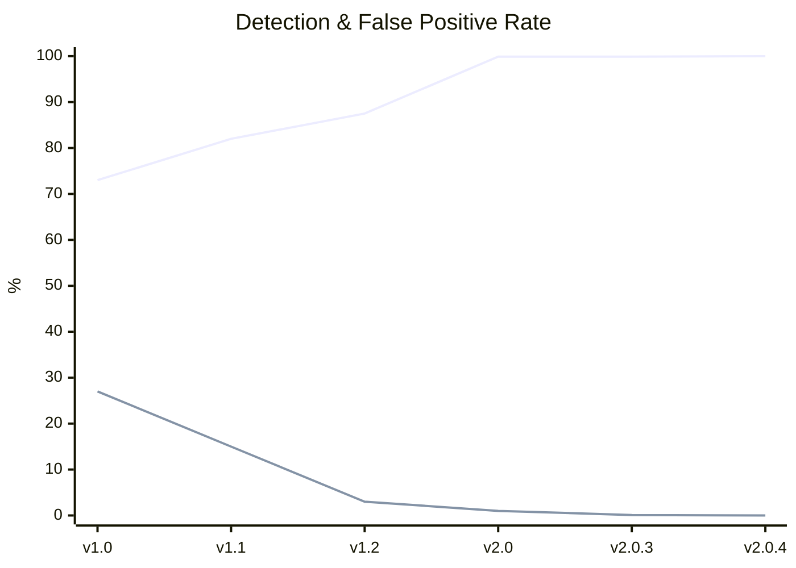

<div align="center">


# Anya

**Fast, offline static malware analysis platform**

<p>
  <a href="https://github.com/elementmerc/anya/actions/workflows/ci.yml"></a>
  <a href="https://github.com/elementmerc/anya/releases/latest"></a>
  <a href="LICENSE.TXT"></a>
  <a href="https://github.com/elementmerc/anya"></a>
</p>
<p>
  <a href="https://github.com/elementmerc/anya"></a>
  <a href="https://github.com/elementmerc/anya"></a>
  <a href="https://github.com/elementmerc/anya"></a>
  <a href="https://github.com/elementmerc/anya"></a>
</p>


</div>

---

Anya analyses files without executing them. Drop a PE, ELF, Mach-O, PDF, Office doc, script, archive, disk image, or any of 24+ supported formats onto the GUI, or pipe files through the CLI. Get hashes, entropy, imports, sections, IOC indicators, MITRE ATT&CK mappings, known malware family matching, a confidence-scored verdict, and a risk score. 250+ files per minute, entirely offline.

**Anya** (AHN-yah) means "eye" in Igbo.

---

## Install

**[Download from GitHub Releases →](https://github.com/elementmerc/anya/releases/latest)**

| Platform | GUI | CLI |
|---|---|---|
| **Windows** | `.exe` installer (NSIS) | `.zip` |
| **macOS** | `.dmg` (Intel + Apple Silicon) | Universal binary (`.tar.gz`) |
| **Linux** | `.AppImage` / `.deb` / `.rpm` | Static musl binary (`.tar.gz`) |

> [!NOTE]
> **macOS users:** right-click the app and select **Open** to bypass the "unidentified developer" warning the first time you launch.

Also available on **[SourceForge](https://sourceforge.net/projects/anya/)**.

```bash
# One-liner install (prompts for CLI, GUI, or both)
curl -fsSL https://raw.githubusercontent.com/elementmerc/anya/main/install.sh | bash
```

```bash
# Docker
docker run --rm -v "$(pwd)/samples:/samples:ro" elementmerc/anya:latest --file /samples/malware.exe --json
```

> [!WARNING]
> Seriously, just use the installer or grab a release. The source is here for transparency, not for building. If you clone and `cargo build` anyway — well, don't say I didn't warn you.

---

## CLI

```bash
anya --file suspicious.exe                    # Analyse a file
anya --file suspicious.exe --json             # JSON output
anya --file suspicious.exe --explain          # Verdict + explanations
anya --directory ./samples --recursive        # Batch scan with progress bar
anya --file suspicious.exe --case nightfall   # Save to investigation case
anya --file suspicious.exe --format html --output report.html
```

Full flag reference: `anya --help`

---

## Deployment

Anya ships as a multi-arch Docker image (amd64 and arm64) for deploying into CI pipelines, batch analysis workloads, and SaaS file upload paths.

### Images

| Registry | Path |
|---|---|
| GitHub Container Registry (canonical) | `ghcr.io/elementmerc/anya` |
| Docker Hub (mirror) | `docker.io/elementmerc/anya` |

Each release publishes three tags to both registries: `:latest`, `:<version>` (e.g. `:2.0.5`), and `:stable`.

### One-off scan

```bash
docker run --rm \
  -v "$(pwd)/samples:/samples:ro" \
  ghcr.io/elementmerc/anya:latest \
  --file /samples/suspicious.exe --format sarif
```

### Compose reference

The repository includes a `docker-compose.yml` with three pre-configured services that demonstrate the common deployment patterns:

```bash
# Single file analysis
docker compose run --rm anya-single

# Batch directory scan with appended JSONL output
docker compose run --rm anya-batch

# Continuous inbox watch (sidecar pattern for upload pipelines)
mkdir -p inbox watch-output
docker compose up anya-watch
cp suspicious.exe inbox/       # verdict appears in `docker compose logs anya-watch`
```

anya-single, anya-batch, and anya-watch each mount distinct output directories so the three services can be run concurrently without collision. anya-single writes to `./output`, anya-batch appends to `./output/batch.jsonl`, and anya-watch writes to `./watch-output`.

All three services run with `read_only: true`, `cap_drop: ALL`, `no-new-privileges`, a custom seccomp profile, and a size-capped noexec tmpfs. The container filesystem is immutable by default.

### SARIF output for CI

For CI ingestion (GitHub Code Scanning, Azure DevOps, GitLab Security), use `--format sarif`:

```bash
docker run --rm \
  -v "$(pwd):/work:ro" \
  -v "$(pwd)/report:/report:rw" \
  ghcr.io/elementmerc/anya:latest \
  --file /work/app.exe --format sarif --output /report/anya.sarif
```

### Environment

Anya does not read any environment variables at runtime. Configuration is expressed through flags. The image runs as a non-root user and has no default network access configured; no inbound ports, no outbound calls.

---

## GUI

Drag a file or folder onto the window, or use the **+** button.

- **Overview** — risk score, hashes, verdict, notes
- **Entropy** — section chart, byte histogram, flatness
- **Imports** — DLL tree with inline explanations
- **Sections** — permissions, entropy, characteristics
- **Strings** — extracted strings with IOC classification
- **Security** — ASLR, DEP, Authenticode, toolchain, certificates
- **Format** — deep analysis for 24+ file types
- **MITRE** — mapped techniques with tactic grouping
- **Graph** — evidence web (single file) or relationship graph (batch)

**Batch mode:** drop a folder to scan everything. Searchable sidebar, interactive relationship graph.

**Teacher Mode:** toggle in Settings for contextual explanations on every finding.

---

## Why Anya?

| | Anya | VirusTotal | PEStudio | CAPA | DIE |
|---|---|---|---|---|---|
| Offline / no upload | ✓ | ✗ | ✓ | ✓ | ✓ |
| Formats | Any file (24+ deep) | Many | PE only | PE/ELF | PE/ELF/Mach-O |
| Heuristic verdict | ✓ | Aggregates | ✗ | ✗ | ✗ |
| MITRE ATT&CK | ✓ | Partial | ✗ | ✓ | ✗ |
| YARA scanning | ✓ | ✓ (cloud) | ✗ | ✗ | ✗ |
| GUI + CLI | Both | Browser | GUI only | CLI only | Both |
| Batch analysis | ✓ | API | ✗ | Scriptable | Scriptable |
| IOC extraction | ✓ | ✓ | ✗ | ✗ | ✗ |
| Case management | ✓ | ✗ | ✗ | ✗ | ✗ |
| Cross-platform | ✓ | Web | Windows | ✓ | ✓ |
| Price | Free / Commercial | Free / $10K+ | Free / €200+ | Free | Free |

---

## Calibration

Anya's scoring engine is calibrated against real malware and benign samples. Every release is tested before shipping.



*FP rate scaled 10x for visibility on the same axis.*

| Version | Malware | Benign | Total | Heuristic | Combined | FP Rate |
|---|---|---|---|---|---|---|
| **v2.0.4** | **~37,800** | **~11,700** | **~49,500** | **75.4%** | **100.0%** | **0.000%** |
| v2.0.3 | ~9,100 | ~11,300 | ~21,700 | — | 99.9% | 0.009% |

**Reading the two detection columns.** The **heuristic** column is Anya's pure static-analysis scorer on each sample, with the Known Sample Database turned off — this is the honest "cold start" number you should expect on a fresh binary that has never been seen before. The **combined** column is heuristic plus the Known Sample Database matcher, which recognises samples by TLSH similarity against a locally-bundled catalogue. On the calibration dataset every malware sample resolves at TLSH distance zero against its own entry in the catalogue, so the combined column is the expected ceiling on known samples.

> **Verify independently:** `anya benchmark ./your-samples/ --ground-truth malware --json`

---

## Docs

- [Architecture](docs/ARCHITECTURE.md)
- [JSON output schema](docs/JSON_SCHEMA.md)
- [CHANGELOG](docs/CHANGELOG.md)
- [Security scope & limitations](SECURITY.md)
- [Privacy policy](docs/PRIVACY.md)
- [Commercial licensing](docs/COMMERCIAL_LICENSE.md)

---

## Licence

AGPL-3.0-or-later. See [LICENSE.TXT](LICENSE.TXT).

Commercial licensing: daniel@themalwarefiles.com
