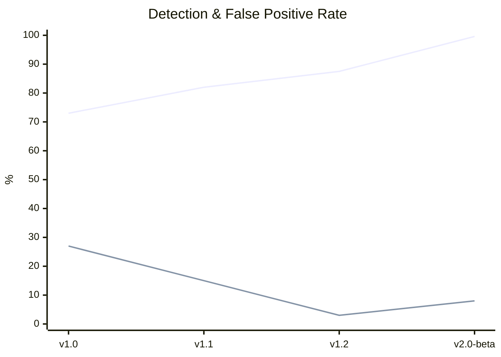

<div align="center">


# Anya

**Fast, offline static malware analysis platform**

<p>
  <a href="https://github.com/elementmerc/anya/actions/workflows/ci.yml"></a>
  <a href="https://github.com/elementmerc/anya/releases/latest"></a>
  <a href="LICENSE.TXT"></a>
  <a href="https://github.com/elementmerc/anya"></a>
  <a href="https://github.com/elementmerc/anya"></a>
  <a href="https://github.com/elementmerc/anya"></a>
  <a href="https://github.com/elementmerc/anya"></a>
  <a href="https://github.com/elementmerc/anya"></a>
</p>


</div>

---

Anya analyses files without executing them. Drop a PE, ELF, Mach-O, PDF, Office doc, script, archive, or any of 20+ supported formats onto the GUI, or pipe files through the CLI. Get hashes, entropy, imports, sections, IOC indicators, MITRE ATT&CK mappings, known malware family matching, a confidence-scored verdict, and a risk score. 200+ files per minute, entirely offline.

**Anya** (AHN-yah) means "eye" in Igbo.

---

## Install

### Download

Grab the latest release for your platform:

**[Download from GitHub Releases →](https://github.com/elementmerc/anya/releases/latest)**

| Platform | GUI | CLI |
|---|---|---|
| **Windows** | `.msi` installer | `.zip` |
| **macOS** | `.dmg` (Intel + Apple Silicon) | Universal binary (`.tar.gz`) |
| **Linux** | `.AppImage` / `.deb` / `.rpm` | Static musl binary (`.tar.gz`) |

Also available on **[SourceForge](https://sourceforge.net/projects/anya/)**.

### One-liner

```bash
curl -fsSL https://raw.githubusercontent.com/elementmerc/anya/main/install.sh | bash
```

Prompts for CLI, GUI, or both. Or specify directly:

```bash
curl -fsSL .../install.sh | bash -s -- --both   # CLI + GUI
curl -fsSL .../install.sh | bash -s -- --cli    # CLI only
curl -fsSL .../install.sh | bash -s -- --gui    # GUI only
```

### Docker

```bash
docker pull elementmerc/anya:latest

docker run --rm \
  -v "$(pwd)/samples:/samples:ro" \
  elementmerc/anya:latest \
  --file /samples/malware.exe --json
```

### Building from source

> [!WARNING]
> Seriously, just use the installer or grab a release. The source is here for transparency, not for building. If you clone and `cargo build` anyway — well, don't say I didn't warn you.

---

## CLI usage

```bash
# Analyse a file
anya --file suspicious.exe

# JSON output
anya --file suspicious.exe --json

# Batch scan
anya --directory ./samples --recursive --json --output results.jsonl --append

# Teacher Mode (guided lessons inline)
anya --file suspicious.exe --guided

# Random Bible verse
anya verse

# Init config
anya --init-config

# Verdict + explanations
anya --file suspicious.exe --explain

# Batch summary table
anya --directory ./samples --recursive --summary

# Check hash against known-bad list
anya hash-check suspicious.exe --against known-bad.txt

# Generate YARA rule from strings
anya yara from-strings strings.txt --output rule.yar

# Combine YARA rules
anya yara combine ./rules combined.yar --recursive

# Save to investigation case
anya --file suspicious.exe --case operation-nightfall

# List cases
anya cases --list
```

### Additional commands

```bash
# Watch a directory for new malware samples
anya watch ./incoming --recursive

# Compare two files side by side
anya compare sample_v1.exe sample_v2.exe

# Generate a standalone HTML report
anya --file suspicious.exe --format html --output report.html

# Generate shell completions
anya completions bash > ~/.bash_completion.d/anya

# Batch analysis with progress bar
anya --directory ./samples --recursive
```

Full flag reference: `anya --help`

---

## GUI

Launch Anya, drag a file onto the drop zone — or use the **+** button for single file or **Batch Analysis** (analyse a whole folder).

| Tab | What it shows |
|---|---|
| Overview | Risk score ring, file metadata, hashes, KSD match, forensic fragment, 3D relationship graph |
| Entropy | Full entropy chart + per-section breakdown, byte histogram, distribution flatness analysis |
| Imports | DLL tree with expandable function lists and inline explanations |
| Sections | Section permission analysis, per-section entropy, characteristics |
| Strings | Extracted strings with IOC extraction, classification, and filtering |
| Security | ASLR, DEP, Authenticode, overlay, debug artifacts, toolchain detection, certificate reputation |
| Format | Format-specific analysis for JS, PowerShell, VBS, OLE, ZIP, HTML, XML, LNK, ISO, and more |
| MITRE | Mapped ATT&CK techniques with tactic tagging and real-world attack examples |

**Batch Analysis** — select a folder to scan all executables. Files appear in a collapsible sidebar with colour-coded verdicts. A summary dashboard shows verdict breakdown, donut chart, and an interactive 3D relationship graph showing TLSH similarity and malware family connections between files.

**Teacher Mode** (toggle in Settings → Learning) surfaces contextual lessons as you navigate. Click any DLL, security card, IOC block, or MITRE technique for beginner-friendly explanations with real-world examples.

**Case management** — Save to Case button in the TopBar, Case Browser on the DropZone for browsing and reopening past investigations.

**Keyboard shortcuts** — Ctrl+O to open a file, 1-7 to switch tabs, ? for a shortcuts overlay.

**File comparison** — side-by-side diff of two analyses highlighting verdict, entropy, import, and string differences.

**Pin findings** — pin important findings to the top of the Overview tab for quick reference.

**Copy-friendly output** — hover any hash, finding, or section to copy it to the clipboard.

**Drag-and-drop tab reorder** — reorder analysis tabs to match your workflow.

**Export HTML report** — generate a standalone HTML report with embedded CSS and SVG charts from the export dropdown.

**Recent files** appear on the drop zone for quick re-analysis. A **guided tour** walks first-time users through the interface.

Analysis history is stored in a local SQLite database. Nothing leaves your device.

---

## Why Anya?

| | Anya | VirusTotal | PEStudio | CAPA | DIE |
|---|---|---|---|---|---|
| Offline / no upload | ✓ | ✗ | ✓ | ✓ | ✓ |
| Formats | Any file (20+ deep) | Many | PE only | PE/ELF | PE/ELF/Mach-O |
| Heuristic verdict | ✓ | Aggregates | ✗ | ✗ | ✗ |
| MITRE ATT&CK | ✓ | Partial | ✗ | ✓ | ✗ |
| YARA scanning | ✓ | ✓ (cloud) | ✗ | ✗ | ✗ |
| GUI + CLI | Both | Browser | GUI only | CLI only | Both |
| Batch analysis | ✓ | API | ✗ | Scriptable | Scriptable |
| IOC extraction | ✓ | ✓ | ✗ | ✗ | ✗ |
| Case management | ✓ | ✗ | ✗ | ✗ | ✗ |
| Cross-platform | ✓ | Web | Windows | ✓ | ✓ |
| Price | Free / Commercial | Free / $10K+ | Free / €200+ | Free | Free |

---

## Calibration

Anya's scoring engine is continuously calibrated against real malware and benign samples. Every release is tested before shipping.



*FP rate scaled 10x for visibility on the same axis.*

| Version | Date | Malware | Benign | Total | Detection | FP Rate | Key changes |
|---|---|---|---|---|---|---|---|
| v1.0 | Feb 2026 | ~1,000 | ~500 | ~1,500 | 73.0% | 2.7% | Initial release — PE/ELF only |
| v1.1 | Feb 2026 | ~1,100 | ~550 | ~1,650 | 82.0% | 1.5% | Improved PE scoring, .NET detection |
| v1.2 | Mar 2026 | ~1,350 | ~650 | ~2,000 | 87.5% | 0.3% | 15 format parsers, known-product suppression |
| **v2.0-beta** | **Apr 2026** | **~1,700** | **~5,400** | **~7,100** | **99.6%** | **0.8%** | **20 parsers, KSD, YARA-X, toolchain fingerprinting, import clustering** |
| v2.0 (target) | — | 3,000+ | 10,000+ | 13,000+ | 100% | 0% | Full calibration pass |

> **Verify independently:** `anya benchmark ./your-samples/ --ground-truth malware --json`

---

## Docs

- [Architecture](docs/ARCHITECTURE.md)
- [JSON output schema](docs/JSON_SCHEMA.md)
- [CHANGELOG](docs/CHANGELOG.md)
- [Security scope & limitations](SECURITY.md)
- [Privacy policy](docs/PRIVACY.md)
- [Commercial licensing](docs/COMMERCIAL_LICENSE.md)

---

## Uninstalling

- **Windows**: Use Add/Remove Programs — the uninstaller launches automatically.
- **Linux**: `sudo apt remove anya` — the uninstaller runs during removal.
- **macOS**: Drag Anya.app to the Trash, then optionally run:
  `~/Applications/Anya.app/Contents/MacOS/anya-gui --uninstall`
  to remove your analysis database and preferences.

---

## Licence

AGPL-3.0-or-later. See [LICENSE.TXT](LICENSE.TXT).

Commercial licensing: daniel@themalwarefiles.com
